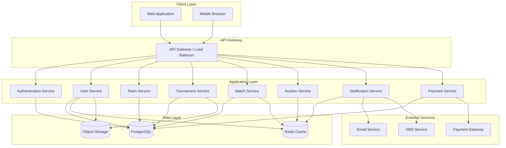

# Design Document: Score Ocean

## Overview

Score Ocean is a comprehensive digital sports management platform built on a modern web architecture. The system follows a client-server model with a RESTful API backend, real-time WebSocket connections for live updates, and a responsive web frontend. The platform is designed to scale to millions of users across India while maintaining low latency for real-time features like live scoring and auction bidding.

### Design Goals

1. **Scalability**: Support millions of concurrent users during peak tournament seasons
2. **Real-time Performance**: Sub-3-second updates for live scores and auction bids
3. **Multi-sport Flexibility**: Extensible architecture to add new sports without major refactoring
4. **Data Integrity**: Ensure consistency across distributed operations (payments, auctions, scoring)
5. **Mobile-First**: Responsive design optimized for mobile devices (primary user interface)
6. **Reliability**: 99.9% uptime with graceful degradation for non-critical features

## Architecture

### High-Level Architecture



### Architecture Patterns

**Microservices Architecture**: Each major domain (User, Team, Tournament, Match, Auction) is implemented as an independent service with its own data store and business logic. This enables:
- Independent scaling of high-traffic services (Match, Auction)
- Isolated deployments and updates
- Technology flexibility per service

**Event-Driven Communication**: Services communicate through an event bus for asynchronous operations:
- Match completion triggers statistics updates, points table recalculation, and notifications
- Payment confirmation triggers registration confirmation and team notifications
- Auction bid events broadcast to all connected clients

**CQRS Pattern for Read-Heavy Operations**: Separate read and write models for:
- Points tables (write on match completion, read frequently)
- Player statistics (write on match completion, read frequently)
- Tournament listings (write rarely, read frequently)

**Cache-Aside Pattern**: Redis caching for frequently accessed data:
- User sessions and authentication tokens
- Active tournament listings
- Live match scores
- Points tables

## Components and Interfaces

### 1. Authentication Service

**Responsibilities**:
- User registration and login
- JWT token generation and validation
- Password hashing and verification
- Role-based access control

**Key Interfaces**:

```typescript
interface AuthService {
  register(email: string, password: string, role: UserRole): Promise<User>
  login(email: string, password: string): Promise<AuthToken>
  validateToken(token: string): Promise<TokenPayload>
  refreshToken(refreshToken: string): Promise<AuthToken>
  logout(token: string): Promise<void>
}

interface AuthToken {
  accessToken: string
  refreshToken: string
  expiresIn: number
}

interface TokenPayload {
  userId: string
  email: string
  role: UserRole
  permissions: Permission[]
}

enum UserRole {
  PLAYER = "PLAYER",
  TEAM = "TEAM",
  ORGANIZATION = "ORGANIZATION",
  ADMIN = "ADMIN"
}
```

### 2. User Service

**Responsibilities**:
- User profile management
- Sport-specific profile creation
- Performance statistics aggregation
- Profile search and discovery

**Key Interfaces**:

```typescript
interface UserService {
  createProfile(userId: string, profile: UserProfile): Promise<User>
  updateProfile(userId: string, updates: Partial<UserProfile>): Promise<User>
  getProfile(userId: string): Promise<User>
  addSportProfile(userId: string, sport: Sport): Promise<SportProfile>
  updateSportProfile(userId: string, sportId: string, stats: SportStats): Promise<SportProfile>
  searchUsers(query: SearchQuery): Promise<User[]>
  getPerformanceStats(userId: string, filters: StatsFilter): Promise<PerformanceStats>
}

interface User {
  id: string
  email: string
  role: UserRole
  profile: UserProfile
  sportProfiles: SportProfile[]
  createdAt: Date
  updatedAt: Date
}

interface UserProfile {
  name: string
  age: number
  location: Location
  contactDetails: ContactDetails
  avatarUrl?: string
}

interface SportProfile {
  id: string
  sport: Sport
  statistics: SportStats
  matchHistory: MatchParticipation[]
}

interface Location {
  city: string
  state: string
  country: string
}

enum Sport {
  CRICKET = "CRICKET",
  FOOTBALL = "FOOTBALL",
  KABADDI = "KABADDI",
  VOLLEYBALL = "VOLLEYBALL"
}
```

### 3. Team Service

**Responsibilities**:
- Team creation and management
- Roster management
- Team invitations
- Team search and discovery

**Key Interfaces**:

```typescript
interface TeamService {
  createTeam(hostId: string, team: TeamCreate): Promise<Team>
  updateTeam(teamId: string, updates: Partial<TeamCreate>): Promise<Team>
  getTeam(teamId: string): Promise<Team>
  invitePlayer(teamId: string, playerId: string): Promise<Invitation>
  acceptInvitation(invitationId: string): Promise<void>
  declineInvitation(invitationId: string): Promise<void>
  removePlayer(teamId: string, playerId: string): Promise<void>
  searchTeams(query: SearchQuery): Promise<Team[]>
  validateRoster(teamId: string, sport: Sport): Promise<RosterValidation>
}

interface Team {
  id: string
  name: string
  sport: Sport
  location: Location
  hostId: string
  roster: Player[]
  statistics: TeamStats
  createdAt: Date
  updatedAt: Date
}

interface TeamCreate {
  name: string
  sport: Sport
  location: Location
}

interface Invitation {
  id: string
  teamId: string
  playerId: string
  status: InvitationStatus
  createdAt: Date
}

enum InvitationStatus {
  PENDING = "PENDING",
  ACCEPTED = "ACCEPTED",
  DECLINED = "DECLINED"
}

interface RosterValidation {
  isValid: boolean
  errors: string[]
  minPlayers: number
  maxPlayers: number
  currentPlayers: number
}
```

### 4. Tournament Service

**Responsibilities**:
- Tournament creation and configuration
- Tournament lifecycle management
- Registration management
- Fixture generation
- Points table calculation

**Key Interfaces**:

```typescript
interface TournamentService {
  createTournament(hostId: string, tournament: TournamentCreate): Promise<Tournament>
  updateTournament(tournamentId: string, updates: Partial<TournamentCreate>): Promise<Tournament>
  getTournament(tournamentId: string): Promise<Tournament>
  publishTournament(tournamentId: string): Promise<Tournament>
  registerTeam(tournamentId: string, teamId: string): Promise<Registration>
  finalizeRegistrations(tournamentId: string): Promise<void>
  generateFixtures(tournamentId: string): Promise<Fixture[]>
  updateFixture(fixtureId: string, updates: FixtureUpdate): Promise<Fixture>
  getPointsTable(tournamentId: string): Promise<PointsTable>
  updateTournamentStatus(tournamentId: string, status: TournamentStatus): Promise<Tournament>
  searchTournaments(query: SearchQuery): Promise<Tournament[]>
}

interface Tournament {
  id: string
  name: string
  sport: Sport
  format: TournamentFormat
  hostId: string
  hostType: "TEAM" | "ORGANIZATION"
  dates: DateRange
  venue: string
  registrationFee: number
  registrationDeadline: Date
  teamCapacity: number
  status: TournamentStatus
  rules: SportRules
  registrations: Registration[]
  fixtures: Fixture[]
  createdAt: Date
  updatedAt: Date
}

interface TournamentCreate {
  name: string
  sport: Sport
  format: TournamentFormat
  dates: DateRange
  venue: string
  registrationFee: number
  registrationDeadline: Date
  teamCapacity: number
  rules: SportRules
}

enum TournamentFormat {
  LEAGUE = "LEAGUE",
  KNOCKOUT = "KNOCKOUT",
  GROUP_KNOCKOUT = "GROUP_KNOCKOUT"
}

enum TournamentStatus {
  DRAFT = "DRAFT",
  REGISTRATION_OPEN = "REGISTRATION_OPEN",
  REGISTRATION_CLOSED = "REGISTRATION_CLOSED",
  FIXTURES_PUBLISHED = "FIXTURES_PUBLISHED",
  IN_PROGRESS = "IN_PROGRESS",
  COMPLETED = "COMPLETED"
}

interface Registration {
  id: string
  tournamentId: string
  teamId: string
  status: RegistrationStatus
  paymentId?: string
  registeredAt: Date
}

enum RegistrationStatus {
  PENDING = "PENDING",
  CONFIRMED = "CONFIRMED",
  CANCELLED = "CANCELLED"
}

interface Fixture {
  id: string
  tournamentId: string
  matchNumber: number
  homeTeamId: string
  awayTeamId: string
  scheduledDate: Date
  venue: string
  status: MatchStatus
  matchId?: string
}

interface PointsTable {
  tournamentId: string
  standings: Standing[]
  lastUpdated: Date
}

interface Standing {
  rank: number
  teamId: string
  teamName: string
  played: number
  won: number
  lost: number
  drawn: number
  points: number
  tiebreaker: number
}
```

### 5. Match Service

**Responsibilities**:
- Live score entry and tracking
- Match result finalization
- Player performance recording
- Real-time score broadcasting

**Key Interfaces**:

```typescript
interface MatchService {
  createMatch(fixtureId: string): Promise<Match>
  getMatch(matchId: string): Promise<Match>
  updateScore(matchId: string, score: ScoreUpdate): Promise<Match>
  finalizeMatch(matchId: string): Promise<Match>
  recordPlayerPerformance(matchId: string, performance: PlayerPerformance): Promise<void>
  getMatchHistory(teamId: string): Promise<Match[]>
  subscribeToMatch(matchId: string, callback: (score: Match) => void): Subscription
}

interface Match {
  id: string
  fixtureId: string
  tournamentId: string
  homeTeamId: string
  awayTeamId: string
  sport: Sport
  status: MatchStatus
  score: Score
  playerPerformances: PlayerPerformance[]
  startTime?: Date
  endTime?: Date
  scoreHistory: ScoreUpdate[]
}

enum MatchStatus {
  SCHEDULED = "SCHEDULED",
  IN_PROGRESS = "IN_PROGRESS",
  COMPLETED = "COMPLETED",
  CANCELLED = "CANCELLED"
}

interface Score {
  homeScore: number
  awayScore: number
  sportSpecificData: SportScore
}

interface ScoreUpdate {
  timestamp: Date
  homeScore: number
  awayScore: number
  sportSpecificData: SportScore
  updatedBy: string
}

interface PlayerPerformance {
  playerId: string
  teamId: string
  statistics: SportStats
}

// Sport-specific score structures
type SportScore = CricketScore | FootballScore | KabaddiScore | VolleyballScore

interface CricketScore {
  runs: number
  wickets: number
  overs: number
  runRate: number
}

interface FootballScore {
  goals: number
  yellowCards: number
  redCards: number
}

interface KabaddiScore {
  points: number
  allOuts: number
}

interface VolleyballScore {
  sets: number
  points: number
}
```

### 6. Auction Service

**Responsibilities**:
- Auction creation and management
- Real-time bidding
- Budget tracking
- Player assignment

**Key Interfaces**:

```typescript
interface AuctionService {
  createAuction(tournamentId: string, config: AuctionConfig): Promise<Auction>
  registerPlayer(auctionId: string, playerId: string, basePrice: number): Promise<void>
  startAuction(auctionId: string): Promise<void>
  placeBid(auctionId: string, playerId: string, teamId: string, amount: number): Promise<Bid>
  getCurrentPlayer(auctionId: string): Promise<AuctionPlayer>
  nextPlayer(auctionId: string): Promise<AuctionPlayer>
  finalizeAuction(auctionId: string): Promise<AuctionResult>
  subscribeToAuction(auctionId: string, callback: (event: AuctionEvent) => void): Subscription
}

interface Auction {
  id: string
  tournamentId: string
  status: AuctionStatus
  config: AuctionConfig
  playerPool: AuctionPlayer[]
  teamBudgets: TeamBudget[]
  currentPlayerIndex: number
  results: AuctionResult[]
  createdAt: Date
}

interface AuctionConfig {
  teamBudget: number
  minSquadSize: number
  maxSquadSize: number
  bidIncrement: number
  bidTimeout: number
}

enum AuctionStatus {
  SETUP = "SETUP",
  IN_PROGRESS = "IN_PROGRESS",
  COMPLETED = "COMPLETED"
}

interface AuctionPlayer {
  playerId: string
  basePrice: number
  currentBid: number
  currentBidder?: string
  status: PlayerAuctionStatus
  bids: Bid[]
}

enum PlayerAuctionStatus {
  PENDING = "PENDING",
  BIDDING = "BIDDING",
  SOLD = "SOLD",
  UNSOLD = "UNSOLD"
}

interface Bid {
  id: string
  auctionId: string
  playerId: string
  teamId: string
  amount: number
  timestamp: Date
}

interface TeamBudget {
  teamId: string
  totalBudget: number
  remainingBudget: number
  playersAcquired: number
}

interface AuctionResult {
  playerId: string
  teamId: string
  finalPrice: number
  totalBids: number
}

interface AuctionEvent {
  type: "BID_PLACED" | "PLAYER_SOLD" | "PLAYER_UNSOLD" | "NEXT_PLAYER"
  data: any
  timestamp: Date
}
```

### 7. Notification Service

**Responsibilities**:
- Multi-channel notification delivery
- Notification preferences management
- Real-time push notifications
- Notification history

**Key Interfaces**:

```typescript
interface NotificationService {
  sendNotification(notification: NotificationCreate): Promise<void>
  getNotifications(userId: string, filters: NotificationFilter): Promise<Notification[]>
  markAsRead(notificationId: string): Promise<void>
  updatePreferences(userId: string, preferences: NotificationPreferences): Promise<void>
  subscribeToNotifications(userId: string, callback: (notification: Notification) => void): Subscription
}

interface Notification {
  id: string
  userId: string
  type: NotificationType
  title: string
  message: string
  data: any
  channels: NotificationChannel[]
  read: boolean
  createdAt: Date
}

interface NotificationCreate {
  userId: string
  type: NotificationType
  title: string
  message: string
  data?: any
  channels?: NotificationChannel[]
}

enum NotificationType {
  TEAM_INVITATION = "TEAM_INVITATION",
  REGISTRATION_CONFIRMED = "REGISTRATION_CONFIRMED",
  FIXTURES_PUBLISHED = "FIXTURES_PUBLISHED",
  MATCH_REMINDER = "MATCH_REMINDER",
  SCORE_UPDATE = "SCORE_UPDATE",
  AUCTION_BID = "AUCTION_BID",
  AUCTION_WON = "AUCTION_WON",
  TOURNAMENT_UPDATE = "TOURNAMENT_UPDATE"
}

enum NotificationChannel {
  IN_APP = "IN_APP",
  EMAIL = "EMAIL",
  SMS = "SMS",
  PUSH = "PUSH"
}

interface NotificationPreferences {
  channels: NotificationChannel[]
  types: NotificationType[]
  quietHours?: TimeRange
}
```

### 8. Payment Service

**Responsibilities**:
- Payment processing
- Transaction management
- Commission calculation
- Payout management

**Key Interfaces**:

```typescript
interface PaymentService {
  initiatePayment(payment: PaymentCreate): Promise<PaymentSession>
  handleWebhook(payload: any, signature: string): Promise<void>
  getPayment(paymentId: string): Promise<Payment>
  getTransactionHistory(userId: string): Promise<Payment[]>
  calculateCommission(amount: number): number
  requestPayout(hostId: string): Promise<Payout>
}

interface Payment {
  id: string
  userId: string
  tournamentId: string
  amount: number
  commission: number
  status: PaymentStatus
  gatewayTransactionId?: string
  createdAt: Date
  completedAt?: Date
}

interface PaymentCreate {
  userId: string
  tournamentId: string
  amount: number
}

interface PaymentSession {
  sessionId: string
  paymentUrl: string
  expiresAt: Date
}

enum PaymentStatus {
  PENDING = "PENDING",
  PROCESSING = "PROCESSING",
  COMPLETED = "COMPLETED",
  FAILED = "FAILED",
  REFUNDED = "REFUNDED"
}

interface Payout {
  id: string
  hostId: string
  amount: number
  status: PayoutStatus
  requestedAt: Date
  processedAt?: Date
}

enum PayoutStatus {
  REQUESTED = "REQUESTED",
  PROCESSING = "PROCESSING",
  COMPLETED = "COMPLETED",
  REJECTED = "REJECTED"
}
```

## Data Models

### Database Schema (PostgreSQL)

```sql
-- Users table
CREATE TABLE users (
  id UUID PRIMARY KEY DEFAULT gen_random_uuid(),
  email VARCHAR(255) UNIQUE NOT NULL,
  password_hash VARCHAR(255) NOT NULL,
  role VARCHAR(50) NOT NULL,
  created_at TIMESTAMP DEFAULT CURRENT_TIMESTAMP,
  updated_at TIMESTAMP DEFAULT CURRENT_TIMESTAMP
);

-- User profiles table
CREATE TABLE user_profiles (
  id UUID PRIMARY KEY DEFAULT gen_random_uuid(),
  user_id UUID REFERENCES users(id) ON DELETE CASCADE,
  name VARCHAR(255) NOT NULL,
  age INTEGER,
  city VARCHAR(100),
  state VARCHAR(100),
  country VARCHAR(100),
  phone VARCHAR(20),
  avatar_url TEXT,
  created_at TIMESTAMP DEFAULT CURRENT_TIMESTAMP,
  updated_at TIMESTAMP DEFAULT CURRENT_TIMESTAMP
);

-- Sport profiles table
CREATE TABLE sport_profiles (
  id UUID PRIMARY KEY DEFAULT gen_random_uuid(),
  user_id UUID REFERENCES users(id) ON DELETE CASCADE,
  sport VARCHAR(50) NOT NULL,
  statistics JSONB NOT NULL DEFAULT '{}',
  created_at TIMESTAMP DEFAULT CURRENT_TIMESTAMP,
  updated_at TIMESTAMP DEFAULT CURRENT_TIMESTAMP,
  UNIQUE(user_id, sport)
);

-- Teams table
CREATE TABLE teams (
  id UUID PRIMARY KEY DEFAULT gen_random_uuid(),
  name VARCHAR(255) NOT NULL,
  sport VARCHAR(50) NOT NULL,
  host_id UUID REFERENCES users(id),
  city VARCHAR(100),
  state VARCHAR(100),
  country VARCHAR(100),
  statistics JSONB DEFAULT '{}',
  created_at TIMESTAMP DEFAULT CURRENT_TIMESTAMP,
  updated_at TIMESTAMP DEFAULT CURRENT_TIMESTAMP
);

-- Team roster table
CREATE TABLE team_rosters (
  id UUID PRIMARY KEY DEFAULT gen_random_uuid(),
  team_id UUID REFERENCES teams(id) ON DELETE CASCADE,
  player_id UUID REFERENCES users(id) ON DELETE CASCADE,
  joined_at TIMESTAMP DEFAULT CURRENT_TIMESTAMP,
  UNIQUE(team_id, player_id)
);

-- Team invitations table
CREATE TABLE team_invitations (
  id UUID PRIMARY KEY DEFAULT gen_random_uuid(),
  team_id UUID REFERENCES teams(id) ON DELETE CASCADE,
  player_id UUID REFERENCES users(id) ON DELETE CASCADE,
  status VARCHAR(50) NOT NULL DEFAULT 'PENDING',
  created_at TIMESTAMP DEFAULT CURRENT_TIMESTAMP,
  updated_at TIMESTAMP DEFAULT CURRENT_TIMESTAMP
);

-- Tournaments table
CREATE TABLE tournaments (
  id UUID PRIMARY KEY DEFAULT gen_random_uuid(),
  name VARCHAR(255) NOT NULL,
  sport VARCHAR(50) NOT NULL,
  format VARCHAR(50) NOT NULL,
  host_id UUID REFERENCES users(id),
  host_type VARCHAR(50) NOT NULL,
  start_date DATE NOT NULL,
  end_date DATE NOT NULL,
  venue TEXT,
  registration_fee DECIMAL(10, 2) DEFAULT 0,
  registration_deadline TIMESTAMP NOT NULL,
  team_capacity INTEGER NOT NULL,
  status VARCHAR(50) NOT NULL DEFAULT 'DRAFT',
  rules JSONB DEFAULT '{}',
  created_at TIMESTAMP DEFAULT CURRENT_TIMESTAMP,
  updated_at TIMESTAMP DEFAULT CURRENT_TIMESTAMP
);

-- Tournament registrations table
CREATE TABLE tournament_registrations (
  id UUID PRIMARY KEY DEFAULT gen_random_uuid(),
  tournament_id UUID REFERENCES tournaments(id) ON DELETE CASCADE,
  team_id UUID REFERENCES teams(id) ON DELETE CASCADE,
  status VARCHAR(50) NOT NULL DEFAULT 'PENDING',
  payment_id UUID,
  registered_at TIMESTAMP DEFAULT CURRENT_TIMESTAMP,
  UNIQUE(tournament_id, team_id)
);

-- Fixtures table
CREATE TABLE fixtures (
  id UUID PRIMARY KEY DEFAULT gen_random_uuid(),
  tournament_id UUID REFERENCES tournaments(id) ON DELETE CASCADE,
  match_number INTEGER NOT NULL,
  home_team_id UUID REFERENCES teams(id),
  away_team_id UUID REFERENCES teams(id),
  scheduled_date TIMESTAMP NOT NULL,
  venue TEXT,
  status VARCHAR(50) NOT NULL DEFAULT 'SCHEDULED',
  match_id UUID,
  created_at TIMESTAMP DEFAULT CURRENT_TIMESTAMP,
  updated_at TIMESTAMP DEFAULT CURRENT_TIMESTAMP
);

-- Matches table
CREATE TABLE matches (
  id UUID PRIMARY KEY DEFAULT gen_random_uuid(),
  fixture_id UUID REFERENCES fixtures(id),
  tournament_id UUID REFERENCES tournaments(id),
  home_team_id UUID REFERENCES teams(id),
  away_team_id UUID REFERENCES teams(id),
  sport VARCHAR(50) NOT NULL,
  status VARCHAR(50) NOT NULL DEFAULT 'SCHEDULED',
  home_score INTEGER DEFAULT 0,
  away_score INTEGER DEFAULT 0,
  sport_specific_data JSONB DEFAULT '{}',
  start_time TIMESTAMP,
  end_time TIMESTAMP,
  created_at TIMESTAMP DEFAULT CURRENT_TIMESTAMP,
  updated_at TIMESTAMP DEFAULT CURRENT_TIMESTAMP
);

-- Score history table
CREATE TABLE score_history (
  id UUID PRIMARY KEY DEFAULT gen_random_uuid(),
  match_id UUID REFERENCES matches(id) ON DELETE CASCADE,
  home_score INTEGER NOT NULL,
  away_score INTEGER NOT NULL,
  sport_specific_data JSONB DEFAULT '{}',
  updated_by UUID REFERENCES users(id),
  timestamp TIMESTAMP DEFAULT CURRENT_TIMESTAMP
);

-- Player performances table
CREATE TABLE player_performances (
  id UUID PRIMARY KEY DEFAULT gen_random_uuid(),
  match_id UUID REFERENCES matches(id) ON DELETE CASCADE,
  player_id UUID REFERENCES users(id),
  team_id UUID REFERENCES teams(id),
  statistics JSONB NOT NULL DEFAULT '{}',
  created_at TIMESTAMP DEFAULT CURRENT_TIMESTAMP
);

-- Auctions table
CREATE TABLE auctions (
  id UUID PRIMARY KEY DEFAULT gen_random_uuid(),
  tournament_id UUID REFERENCES tournaments(id) ON DELETE CASCADE,
  status VARCHAR(50) NOT NULL DEFAULT 'SETUP',
  team_budget DECIMAL(10, 2) NOT NULL,
  min_squad_size INTEGER NOT NULL,
  max_squad_size INTEGER NOT NULL,
  bid_increment DECIMAL(10, 2) NOT NULL,
  bid_timeout INTEGER NOT NULL,
  current_player_index INTEGER DEFAULT 0,
  created_at TIMESTAMP DEFAULT CURRENT_TIMESTAMP,
  updated_at TIMESTAMP DEFAULT CURRENT_TIMESTAMP
);

-- Auction players table
CREATE TABLE auction_players (
  id UUID PRIMARY KEY DEFAULT gen_random_uuid(),
  auction_id UUID REFERENCES auctions(id) ON DELETE CASCADE,
  player_id UUID REFERENCES users(id),
  base_price DECIMAL(10, 2) NOT NULL,
  current_bid DECIMAL(10, 2),
  current_bidder_id UUID REFERENCES teams(id),
  status VARCHAR(50) NOT NULL DEFAULT 'PENDING',
  created_at TIMESTAMP DEFAULT CURRENT_TIMESTAMP,
  updated_at TIMESTAMP DEFAULT CURRENT_TIMESTAMP
);

-- Auction bids table
CREATE TABLE auction_bids (
  id UUID PRIMARY KEY DEFAULT gen_random_uuid(),
  auction_id UUID REFERENCES auctions(id) ON DELETE CASCADE,
  player_id UUID REFERENCES users(id),
  team_id UUID REFERENCES teams(id),
  amount DECIMAL(10, 2) NOT NULL,
  timestamp TIMESTAMP DEFAULT CURRENT_TIMESTAMP
);

-- Auction results table
CREATE TABLE auction_results (
  id UUID PRIMARY KEY DEFAULT gen_random_uuid(),
  auction_id UUID REFERENCES auctions(id) ON DELETE CASCADE,
  player_id UUID REFERENCES users(id),
  team_id UUID REFERENCES teams(id),
  final_price DECIMAL(10, 2) NOT NULL,
  total_bids INTEGER NOT NULL,
  created_at TIMESTAMP DEFAULT CURRENT_TIMESTAMP
);

-- Payments table
CREATE TABLE payments (
  id UUID PRIMARY KEY DEFAULT gen_random_uuid(),
  user_id UUID REFERENCES users(id),
  tournament_id UUID REFERENCES tournaments(id),
  amount DECIMAL(10, 2) NOT NULL,
  commission DECIMAL(10, 2) NOT NULL,
  status VARCHAR(50) NOT NULL DEFAULT 'PENDING',
  gateway_transaction_id VARCHAR(255),
  created_at TIMESTAMP DEFAULT CURRENT_TIMESTAMP,
  completed_at TIMESTAMP
);

-- Notifications table
CREATE TABLE notifications (
  id UUID PRIMARY KEY DEFAULT gen_random_uuid(),
  user_id UUID REFERENCES users(id) ON DELETE CASCADE,
  type VARCHAR(50) NOT NULL,
  title VARCHAR(255) NOT NULL,
  message TEXT NOT NULL,
  data JSONB DEFAULT '{}',
  channels TEXT[] NOT NULL,
  read BOOLEAN DEFAULT FALSE,
  created_at TIMESTAMP DEFAULT CURRENT_TIMESTAMP
);

-- Notification preferences table
CREATE TABLE notification_preferences (
  id UUID PRIMARY KEY DEFAULT gen_random_uuid(),
  user_id UUID REFERENCES users(id) ON DELETE CASCADE UNIQUE,
  channels TEXT[] NOT NULL,
  types TEXT[] NOT NULL,
  quiet_hours_start TIME,
  quiet_hours_end TIME,
  created_at TIMESTAMP DEFAULT CURRENT_TIMESTAMP,
  updated_at TIMESTAMP DEFAULT CURRENT_TIMESTAMP
);

-- Certificates table
CREATE TABLE certificates (
  id UUID PRIMARY KEY DEFAULT gen_random_uuid(),
  tournament_id UUID REFERENCES tournaments(id),
  user_id UUID REFERENCES users(id),
  team_id UUID REFERENCES teams(id),
  certificate_url TEXT NOT NULL,
  verification_code VARCHAR(50) UNIQUE NOT NULL,
  issued_at TIMESTAMP DEFAULT CURRENT_TIMESTAMP
);

-- Indexes for performance
CREATE INDEX idx_users_email ON users(email);
CREATE INDEX idx_sport_profiles_user_sport ON sport_profiles(user_id, sport);
CREATE INDEX idx_teams_sport ON teams(sport);
CREATE INDEX idx_team_rosters_team ON team_rosters(team_id);
CREATE INDEX idx_team_rosters_player ON team_rosters(player_id);
CREATE INDEX idx_tournaments_status ON tournaments(status);
CREATE INDEX idx_tournaments_sport ON tournaments(sport);
CREATE INDEX idx_tournament_registrations_tournament ON tournament_registrations(tournament_id);
CREATE INDEX idx_fixtures_tournament ON fixtures(tournament_id);
CREATE INDEX idx_matches_tournament ON matches(tournament_id);
CREATE INDEX idx_matches_status ON matches(status);
CREATE INDEX idx_score_history_match ON score_history(match_id);
CREATE INDEX idx_player_performances_match ON player_performances(match_id);
CREATE INDEX idx_player_performances_player ON player_performances(player_id);
CREATE INDEX idx_auction_players_auction ON auction_players(auction_id);
CREATE INDEX idx_auction_bids_auction ON auction_bids(auction_id);
CREATE INDEX idx_payments_user ON payments(user_id);
CREATE INDEX idx_payments_tournament ON payments(tournament_id);
CREATE INDEX idx_notifications_user ON notifications(user_id);
CREATE INDEX idx_notifications_read ON notifications(user_id, read);
```

### Redis Data Structures

**Session Storage**:
```
Key: session:{userId}
Type: Hash
Fields: {accessToken, refreshToken, expiresAt, role, permissions}
TTL: 24 hours
```

**Live Match Scores**:
```
Key: match:{matchId}:score
Type: Hash
Fields: {homeScore, awayScore, status, lastUpdate, sportSpecificData}
TTL: 7 days after match completion
```

**Active Auctions**:
```
Key: auction:{auctionId}:state
Type: Hash
Fields: {currentPlayerId, currentBid, currentBidder, timeRemaining}
TTL: 24 hours after auction completion
```

**Points Table Cache**:
```
Key: tournament:{tournamentId}:points
Type: Sorted Set
Score: points (with tiebreaker in decimal)
Member: teamId
TTL: 1 hour
```

**Real-time Connections**:
```
Key: connections:{userId}
Type: Set
Members: [connectionId1, connectionId2, ...]
TTL: None (managed by connection lifecycle)
```


## Correctness Properties

A property is a characteristic or behavior that should hold true across all valid executions of a system—essentially, a formal statement about what the system should do. Properties serve as the bridge between human-readable specifications and machine-verifiable correctness guarantees.

### Authentication and User Management Properties

**Property 1: Registration creates account with correct role**
*For any* valid registration data (email, password, role), creating an account should result in a user record with the specified role that can be retrieved.
**Validates: Requirements 1.1, 1.6**

**Property 2: Invalid credentials are rejected**
*For any* invalid registration data (malformed email, weak password, invalid role), the registration attempt should fail with specific validation errors.
**Validates: Requirements 1.2**

**Property 3: Authentication round-trip**
*For any* registered user, logging in with their correct credentials should succeed and return a valid authentication token.
**Validates: Requirements 1.3**

**Property 4: Wrong credentials fail authentication**
*For any* registered user, attempting to log in with incorrect password should fail with an authentication error.
**Validates: Requirements 1.4**

**Property 5: Email uniqueness constraint**
*For any* existing user email, attempting to register a new account with the same email should fail.
**Validates: Requirements 1.5**

### Profile Management Properties

**Property 6: Profile data persistence**
*For any* valid profile data, creating or updating a profile should result in the data being stored and retrievable with all fields intact.
**Validates: Requirements 2.1, 2.4**

**Property 7: Sport profile creation**
*For any* valid sport (Cricket, Football, Kabaddi, Volleyball), adding it to a player profile should create a sport profile with the correct sport-specific statistical fields.
**Validates: Requirements 2.2, 13.1, 13.2, 13.3, 13.4**

**Property 8: Sport validation**
*For any* sport value, the system should accept only Cricket, Football, Kabaddi, and Volleyball, rejecting all other values.
**Validates: Requirements 2.3**

**Property 9: Statistics aggregation correctness**
*For any* player and sport, the aggregate statistics should equal the sum or average (as appropriate) of all individual match performances for that sport.
**Validates: Requirements 2.5, 2.6, 9.1, 9.2**

**Property 10: Statistics filtering correctness**
*For any* player and filter criteria (date range or tournament), the filtered statistics should only include matches that meet the filter criteria.
**Validates: Requirements 9.3, 9.4**

### Team Management Properties

**Property 11: Team data persistence**
*For any* valid team data, creating a team should result in the data being stored and retrievable with all fields intact.
**Validates: Requirements 3.1**

**Property 12: Invitation creates notification**
*For any* team invitation, a notification should be created and delivered to the invited player.
**Validates: Requirements 3.2, 10.1**

**Property 13: Invitation acceptance adds to roster**
*For any* pending invitation, accepting it should add the player to the team's roster and the player should appear in roster queries.
**Validates: Requirements 3.3**

**Property 14: Invitation decline removes invitation**
*For any* pending invitation, declining it should remove the invitation and create a notification for the team manager.
**Validates: Requirements 3.4**

**Property 15: Roster removal updates immediately**
*For any* player in a team roster, removing them should result in the player no longer appearing in roster queries.
**Validates: Requirements 3.5**

**Property 16: Roster size constraints**
*For any* sport and team, attempting to add players beyond the maximum roster size should fail, and registering for tournaments with fewer than minimum players should fail.
**Validates: Requirements 3.6, 3.7**

### Tournament Management Properties

**Property 17: Tournament data persistence**
*For any* valid tournament data, creating a tournament should result in the data being stored and retrievable with all fields intact.
**Validates: Requirements 4.1, 4.5**

**Property 18: Tournament format validation**
*For any* tournament format value, the system should accept only League, Knockout, and Group+Knockout, rejecting all other values.
**Validates: Requirements 4.2**

**Property 19: Registration deadline enforcement**
*For any* tournament, registration attempts after the deadline should fail.
**Validates: Requirements 4.3, 5.6**

**Property 20: Team capacity enforcement**
*For any* tournament, registration attempts when capacity is reached should fail.
**Validates: Requirements 4.4**

**Property 21: Tournament visibility after publication**
*For any* tournament, publishing it should make it appear in search results and tournament listings.
**Validates: Requirements 4.6**

**Property 22: Role-based tournament creation**
*For any* user with Team or Organization role, they should be able to create tournaments; users with Player role should also be able to create tournaments.
**Validates: Requirements 4.7, 14.1, 14.7**

**Property 23: Registration validation**
*For any* tournament registration attempt, it should only succeed when registration is open, capacity is available, and roster meets minimum requirements.
**Validates: Requirements 5.1**

### Payment Properties

**Property 24: Payment initiation**
*For any* tournament registration requiring payment, initiating registration should create a payment session with the payment gateway.
**Validates: Requirements 5.2, 15.1**

**Property 25: Successful payment confirms registration**
*For any* pending registration with successful payment, the registration status should update to confirmed.
**Validates: Requirements 5.3, 15.3**

**Property 26: Failed payment keeps registration pending**
*For any* pending registration with failed payment, the registration status should remain pending and a notification should be sent.
**Validates: Requirements 5.4, 15.4**

**Property 27: Payment record completeness**
*For any* payment transaction, the stored record should contain transaction ID, amount, timestamp, and commission.
**Validates: Requirements 5.5, 15.5**

**Property 28: Commission calculation correctness**
*For any* registration fee amount, the calculated commission should equal the fee multiplied by the platform commission rate.
**Validates: Requirements 15.6**

**Property 29: Revenue calculation correctness**
*For any* tournament host, the displayed total revenue should equal the sum of all confirmed registration fees minus commissions.
**Validates: Requirements 15.7**

### Fixture Generation Properties

**Property 30: Fixture generation completeness**
*For any* tournament with finalized registrations, generating fixtures should create matches for all registered teams according to the tournament format.
**Validates: Requirements 6.1**

**Property 31: Round-robin fixture correctness**
*For any* League format tournament with N teams, fixture generation should create exactly N*(N-1)/2 matches where each team plays every other team exactly once.
**Validates: Requirements 6.2**

**Property 32: Knockout bracket correctness**
*For any* Knockout format tournament with N teams, fixture generation should create exactly N-1 matches in a proper single-elimination bracket structure.
**Validates: Requirements 6.3**

**Property 33: Group+Knockout fixture correctness**
*For any* Group+Knockout format tournament, fixture generation should create round-robin fixtures for each group plus knockout fixtures for the qualifying teams.
**Validates: Requirements 6.4**

**Property 34: Sequential match numbering**
*For any* generated fixtures, match numbers should be sequential starting from 1 with no gaps or duplicates.
**Validates: Requirements 6.5**

**Property 35: Fixture modification persistence**
*For any* fixture, updates to date, time, or venue should persist and be retrievable.
**Validates: Requirements 6.6**

**Property 36: Fixture publication notifications**
*For any* fixture publication, all teams participating in those fixtures should receive notifications.
**Validates: Requirements 6.7, 10.3**

### Live Scoring Properties

**Property 37: Score update authorization**
*For any* match, only authorized users should be able to update the score; unauthorized users should be denied.
**Validates: Requirements 7.1, 14.2**

**Property 38: Sport-specific score validation**
*For any* score update, the score format should be validated against the sport's rules, and invalid scores should be rejected.
**Validates: Requirements 7.2, 16.4**

**Property 39: Score update persistence**
*For any* valid score update, it should be stored with a timestamp and be retrievable from the match record.
**Validates: Requirements 7.3**

**Property 40: Score broadcast to connected clients**
*For any* score update, all clients subscribed to that match should receive the update.
**Validates: Requirements 7.4**

**Property 41: Score history completeness**
*For any* match, all score updates should be stored in the score history with no updates lost.
**Validates: Requirements 7.5**

**Property 42: Finalized match immutability**
*For any* finalized match, attempts to update the score should fail (except for admin users).
**Validates: Requirements 7.6, 17.2, 17.6**

### Points Table Properties

**Property 43: Points table updates on match completion**
*For any* completed match, the tournament points table should be recalculated to reflect the match result.
**Validates: Requirements 8.1, 17.4**

**Property 44: Sport-specific points calculation**
*For any* match result, points awarded should follow the sport-specific rules (e.g., 2 points for win, 1 for draw, 0 for loss).
**Validates: Requirements 8.2**

**Property 45: Tiebreaker calculation correctness**
*For any* team in a tournament, tiebreaker values (goal difference, win percentage, etc.) should be calculated correctly from match data.
**Validates: Requirements 8.3**

**Property 46: Points table ranking correctness**
*For any* points table, teams should be ranked first by points, then by tiebreaker values, with no two teams having the same rank.
**Validates: Requirements 8.4, 8.5, 8.6**

### Notification Properties

**Property 47: Registration confirmation notifications**
*For any* confirmed tournament registration, all players in the team roster should receive notifications.
**Validates: Requirements 10.2**

**Property 48: Match reminder notifications**
*For any* match scheduled within 24 hours, participating teams should receive reminder notifications.
**Validates: Requirements 10.4**

**Property 49: Score update notifications**
*For any* score update in a match, all players in the participating teams should receive notifications.
**Validates: Requirements 10.5**

**Property 50: Notification preferences enforcement**
*For any* user with configured notification preferences, notifications should only be sent through the enabled channels and for the enabled event types.
**Validates: Requirements 10.6**

**Property 51: Notification history completeness**
*For any* sent notification, it should be stored in the recipient's notification history and be retrievable.
**Validates: Requirements 10.7**

### Search Properties

**Property 52: Search result relevance**
*For any* search query, all returned results should contain the query term in at least one searchable field (name, location, sport).
**Validates: Requirements 11.1, 11.2, 11.3**

**Property 53: Search result completeness**
*For any* search result, it should include all required profile information and statistics.
**Validates: Requirements 11.4**

**Property 54: Search result ranking**
*For any* search results, items with more field matches should rank higher than items with fewer matches.
**Validates: Requirements 11.5**

**Property 55: Search filter correctness**
*For any* search with filters applied, all results should match the filter criteria (sport, location, performance level).
**Validates: Requirements 11.6**

### Certificate Properties

**Property 56: Certificate generation for all participants**
*For any* completed tournament, all participants should have certificates generated.
**Validates: Requirements 12.1**

**Property 57: Certificate content completeness**
*For any* generated certificate, it should contain tournament name, date, participant name, team name, and final ranking.
**Validates: Requirements 12.2**

**Property 58: Certificate format validation**
*For any* generated certificate, it should be a valid PDF file.
**Validates: Requirements 12.3**

**Property 59: Certificate accessibility**
*For any* generated certificate, it should be accessible for download from the user's profile.
**Validates: Requirements 12.4**

**Property 60: Certificate ID uniqueness**
*For any* two certificates, they should have different certificate IDs.
**Validates: Requirements 12.5**

**Property 61: Certificate verification**
*For any* certificate with a verification URL, accessing that URL should return the certificate data.
**Validates: Requirements 12.6**

### Access Control Properties

**Property 62: Tournament ownership enforcement**
*For any* tournament, only the host (creator) or admin users should be able to modify it; other users should be denied.
**Validates: Requirements 14.3**

**Property 63: Admin unrestricted access**
*For any* system operation, admin users should be able to perform it regardless of ownership or other restrictions.
**Validates: Requirements 14.4**

**Property 64: Permission validation on all operations**
*For any* role-restricted operation, the system should validate user permissions before execution.
**Validates: Requirements 14.5**

**Property 65: Permission updates take effect immediately**
*For any* user whose role changes, subsequent operations should use the new role's permissions.
**Validates: Requirements 14.6**

### Data Validation Properties

**Property 66: Required field validation**
*For any* form submission, if required fields are missing, the submission should fail with specific error messages.
**Validates: Requirements 16.1, 16.6**

**Property 67: Email format validation**
*For any* email input, invalid email formats should be rejected.
**Validates: Requirements 16.2**

**Property 68: Date validation**
*For any* date input, invalid date formats or logically invalid dates (e.g., February 30) should be rejected.
**Validates: Requirements 16.3**

**Property 69: File upload validation**
*For any* file upload, files exceeding size limits or with invalid types should be rejected.
**Validates: Requirements 16.5**

### Match Finalization Properties

**Property 70: Match finalization triggers updates**
*For any* match finalization, player statistics and tournament points table should be updated based on the final score.
**Validates: Requirements 17.1, 17.3**

**Property 71: Match finalization notifications**
*For any* finalized match, both participating teams should receive result notifications.
**Validates: Requirements 17.5**

### Tournament Lifecycle Properties

**Property 72: Tournament status transitions**
*For any* tournament, status should transition through the valid sequence: Draft → Registration_Open → Registration_Closed → Fixtures_Published → In_Progress → Completed, and invalid transitions should be rejected.
**Validates: Requirements 18.1, 18.2, 18.4, 18.5, 18.6, 18.7**

**Property 73: Deadline-based status transition**
*For any* tournament, when the registration deadline passes, status should automatically transition to Registration_Closed.
**Validates: Requirements 18.3**

**Property 74: Status change notifications**
*For any* tournament status change, all registered teams should receive notifications.
**Validates: Requirements 18.8**

### Real-Time Synchronization Properties

**Property 75: Reconnection synchronization**
*For any* client that disconnects and reconnects, all updates that occurred during disconnection should be delivered upon reconnection.
**Validates: Requirements 19.5**

**Property 76: Concurrent update preservation**
*For any* set of concurrent score updates to the same match, all updates should be preserved in the score history without data loss.
**Validates: Requirements 19.6**

### Cross-Platform Properties

**Property 77: Feature parity across platforms**
*For any* feature available on desktop, it should also be available and functional on mobile interfaces.
**Validates: Requirements 20.5**

### Auction Properties

**Property 78: Auction creation**
*For any* tournament with auction mode enabled, an auction pool should be created for player registration.
**Validates: Requirements 21.1**

**Property 79: Player auction registration**
*For any* player registering for an auction with a base price, they should be added to the auction pool with that base price.
**Validates: Requirements 21.2**

**Property 80: Auction pool visibility**
*For any* auction that has begun, all registered players should be visible to all participating teams.
**Validates: Requirements 21.3**

**Property 81: Bid validation**
*For any* bid placed on a player, it should only be accepted if it exceeds the current highest bid; lower bids should be rejected.
**Validates: Requirements 21.4**

**Property 82: Bid broadcast**
*For any* accepted bid, all teams participating in the auction should receive the bid update.
**Validates: Requirements 21.5**

**Property 83: Player assignment to highest bidder**
*For any* player whose bidding time expires, the player should be assigned to the team with the highest bid.
**Validates: Requirements 21.6**

**Property 84: Budget deduction correctness**
*For any* successful bid, the team's remaining budget should decrease by exactly the bid amount.
**Validates: Requirements 21.7**

**Property 85: Budget exhaustion prevents bidding**
*For any* team with zero remaining budget, attempts to place bids should be rejected.
**Validates: Requirements 21.8**

**Property 86: Auction roster finalization**
*For any* completed auction, team rosters should match the auction assignment results.
**Validates: Requirements 21.9**

**Property 87: Squad size enforcement during auction**
*For any* team during auction, the number of acquired players should not exceed maximum squad size, and auction should not complete until all teams meet minimum squad size.
**Validates: Requirements 21.10**

**Property 88: Auction sale notifications**
*For any* player sold in auction, both the player and the winning team should receive notifications.
**Validates: Requirements 21.11**

**Property 89: Auction history completeness**
*For any* auction, all bids placed should be stored in the auction history with player ID, team ID, amount, and timestamp.
**Validates: Requirements 21.12**


## Error Handling

### Error Categories

**1. Validation Errors (400 Bad Request)**
- Invalid input data (malformed email, invalid dates, missing required fields)
- Business rule violations (roster size exceeded, registration after deadline)
- Format errors (invalid score format for sport, invalid file type)

**2. Authentication Errors (401 Unauthorized)**
- Invalid credentials
- Expired or invalid tokens
- Missing authentication headers

**3. Authorization Errors (403 Forbidden)**
- Insufficient permissions for operation
- Attempting to modify another user's resources
- Role-based access violations

**4. Resource Not Found (404 Not Found)**
- Requested user, team, tournament, or match does not exist
- Invalid resource IDs

**5. Conflict Errors (409 Conflict)**
- Duplicate email registration
- Concurrent modification conflicts
- State transition violations (e.g., updating finalized match)

**6. External Service Errors (502 Bad Gateway, 503 Service Unavailable)**
- Payment gateway failures
- Email/SMS service failures
- Object storage failures

**7. Rate Limiting (429 Too Many Requests)**
- Excessive API calls from a single client
- Auction bid spam prevention

### Error Response Format

All errors follow a consistent JSON structure:

```typescript
interface ErrorResponse {
  error: {
    code: string
    message: string
    details?: any
    timestamp: Date
    requestId: string
  }
}
```

### Error Handling Strategies

**Retry Logic**:
- Automatic retry for transient failures (network timeouts, temporary service unavailability)
- Exponential backoff for external service calls
- Maximum 3 retry attempts before failing

**Circuit Breaker Pattern**:
- Protect against cascading failures from external services
- Open circuit after 5 consecutive failures
- Half-open state after 30 seconds to test recovery

**Graceful Degradation**:
- Non-critical features (notifications, statistics) fail silently without blocking core operations
- Cached data served when real-time updates unavailable
- Read-only mode when database writes fail

**Transaction Management**:
- Database transactions for multi-step operations (match finalization, auction completion)
- Rollback on any step failure
- Idempotency keys for payment operations

**Logging and Monitoring**:
- All errors logged with context (user ID, operation, stack trace)
- Critical errors trigger alerts (payment failures, data corruption)
- Error rate monitoring per endpoint

### Specific Error Scenarios

**Payment Failures**:
- Webhook validation failures logged and alerted
- Failed payments keep registration in pending state
- Users notified with retry instructions
- Automatic refund initiation for partial failures

**Auction Failures**:
- Network disconnection during bidding: client reconnects and syncs state
- Concurrent bid conflicts: last valid bid wins, others notified
- Budget calculation errors: auction paused, admin notified

**Real-Time Update Failures**:
- WebSocket connection loss: automatic reconnection with exponential backoff
- Missed updates delivered on reconnection
- Fallback to polling if WebSocket unavailable

**Data Integrity Failures**:
- Constraint violations logged and investigated
- Automatic data consistency checks after critical operations
- Admin tools for manual data correction

## Testing Strategy

### Dual Testing Approach

The testing strategy combines unit tests for specific scenarios and property-based tests for comprehensive coverage:

**Unit Tests**: Focus on specific examples, edge cases, and integration points
- Concrete test cases with known inputs and expected outputs
- Edge cases (empty rosters, single-team tournaments, boundary values)
- Error conditions and validation failures
- Integration between services

**Property-Based Tests**: Verify universal properties across all inputs
- Generate random valid inputs to test properties
- Minimum 100 iterations per property test
- Each property test references its design document property
- Tag format: **Feature: score-ocean, Property {number}: {property_text}**

### Property-Based Testing Library

**TypeScript/JavaScript**: Use `fast-check` library
```typescript
import fc from 'fast-check'

// Example property test
test('Feature: score-ocean, Property 31: Round-robin fixture correctness', () => {
  fc.assert(
    fc.property(
      fc.integer({ min: 2, max: 20 }), // N teams
      (numTeams) => {
        const teams = generateTeams(numTeams)
        const fixtures = generateRoundRobinFixtures(teams)
        
        // Should create exactly N*(N-1)/2 matches
        expect(fixtures.length).toBe((numTeams * (numTeams - 1)) / 2)
        
        // Each team should play every other team exactly once
        const matchups = new Set()
        fixtures.forEach(f => {
          const key = [f.homeTeamId, f.awayTeamId].sort().join('-')
          expect(matchups.has(key)).toBe(false)
          matchups.add(key)
        })
      }
    ),
    { numRuns: 100 }
  )
})
```

### Test Coverage Requirements

**Unit Test Coverage**:
- Minimum 80% code coverage for business logic
- 100% coverage for critical paths (payments, scoring, auctions)
- All error handling paths tested

**Property Test Coverage**:
- Each correctness property implemented as a property-based test
- All CRUD operations tested with random valid inputs
- All validation rules tested with random invalid inputs

### Testing Layers

**1. Unit Tests (Service Layer)**
- Individual service methods
- Data validation logic
- Business rule enforcement
- Mock external dependencies

**2. Integration Tests (API Layer)**
- End-to-end API workflows
- Database interactions
- Service-to-service communication
- Authentication and authorization

**3. Property-Based Tests (Business Logic)**
- Correctness properties from design document
- Invariant preservation
- Round-trip properties (serialization, state transitions)
- Metamorphic properties (filtering, aggregation)

**4. End-to-End Tests (User Workflows)**
- Complete user journeys (registration → tournament → match → results)
- Real-time features (live scoring, auction bidding)
- Multi-user scenarios (concurrent operations)

**5. Performance Tests**
- Load testing for high-traffic scenarios (live matches, auctions)
- Stress testing for concurrent operations
- Latency testing for real-time updates

### Test Data Generation

**Property Test Generators**:
```typescript
// User generator
const userArb = fc.record({
  email: fc.emailAddress(),
  password: fc.string({ minLength: 8, maxLength: 50 }),
  role: fc.constantFrom('PLAYER', 'TEAM', 'ORGANIZATION', 'ADMIN'),
  name: fc.string({ minLength: 1, maxLength: 100 }),
  age: fc.integer({ min: 10, max: 100 })
})

// Team generator
const teamArb = fc.record({
  name: fc.string({ minLength: 1, maxLength: 100 }),
  sport: fc.constantFrom('CRICKET', 'FOOTBALL', 'KABADDI', 'VOLLEYBALL'),
  location: fc.record({
    city: fc.string({ minLength: 1, maxLength: 50 }),
    state: fc.string({ minLength: 1, maxLength: 50 }),
    country: fc.constant('India')
  })
})

// Tournament generator
const tournamentArb = fc.record({
  name: fc.string({ minLength: 1, maxLength: 100 }),
  sport: fc.constantFrom('CRICKET', 'FOOTBALL', 'KABADDI', 'VOLLEYBALL'),
  format: fc.constantFrom('LEAGUE', 'KNOCKOUT', 'GROUP_KNOCKOUT'),
  teamCapacity: fc.integer({ min: 2, max: 32 }),
  registrationFee: fc.float({ min: 0, max: 10000 })
})

// Score generator (sport-specific)
const cricketScoreArb = fc.record({
  runs: fc.integer({ min: 0, max: 500 }),
  wickets: fc.integer({ min: 0, max: 10 }),
  overs: fc.float({ min: 0, max: 50 })
})

const footballScoreArb = fc.record({
  goals: fc.integer({ min: 0, max: 20 }),
  yellowCards: fc.integer({ min: 0, max: 5 }),
  redCards: fc.integer({ min: 0, max: 2 })
})
```

### Continuous Integration

**Pre-commit Hooks**:
- Run unit tests
- Run linting and type checking
- Run fast property tests (10 iterations)

**Pull Request Checks**:
- Full unit test suite
- Full property test suite (100 iterations)
- Integration tests
- Code coverage report

**Nightly Builds**:
- Extended property tests (1000 iterations)
- Performance tests
- End-to-end tests
- Security scans

### Test Maintenance

**Property Test Failures**:
- When a property test fails, it provides a minimal failing example
- Add the failing example as a unit test
- Fix the bug
- Verify property test passes with fix

**Regression Prevention**:
- All bugs get a unit test before fixing
- Critical bugs get a property test if applicable
- Test suite run on every commit

**Test Documentation**:
- Each property test includes comment linking to design property
- Complex test scenarios documented with examples
- Test data generators documented with constraints

